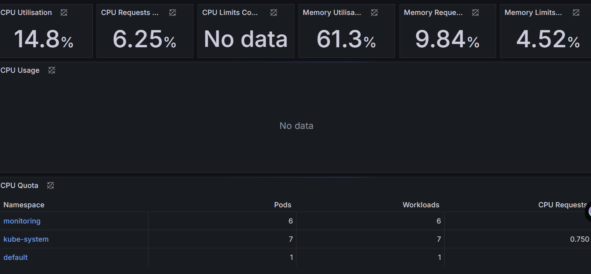
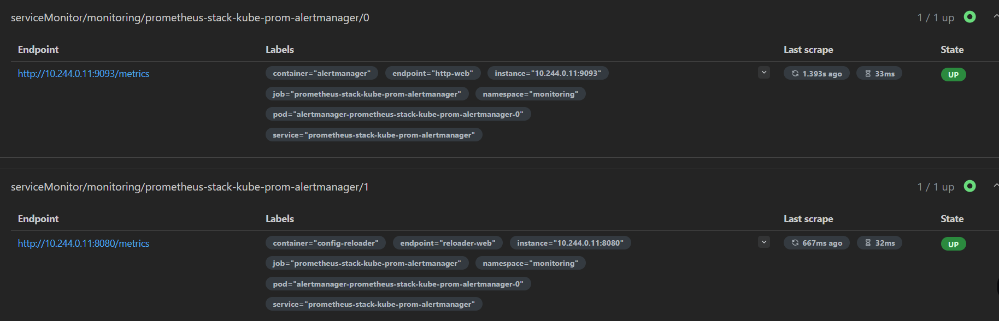

# Cloud-Native Observability Platform on Kubernetes

[](https://opensource.org/licenses/MIT)
[](README.md#key-contributions)

This project demonstrates the deployment and monitoring of a simple web application within a local Kubernetes cluster, leveraging industry-standard observability tools. It showcases fundamental cloud-native and DevOps practices.

## Project Overview
The primary goal of this project was to build a foundational, end-to-end cloud-native stack. This involved deploying a web application into a Kubernetes environment and then setting up a comprehensive monitoring solution to observe its performance, health, and the Kubernetes cluster itself. The project emphasizes hands-on experience with containerization, orchestration, and integrating robust monitoring systems.

## Technologies Used
* **Kubernetes (Minikube):** For orchestrating and managing containerized applications on a local cluster.
* **Docker:** Used as the underlying driver for Minikube, demonstrating interaction with containerization technology.
* **Nginx:** A lightweight, high-performance web server deployed as the sample application for monitoring.
* **Prometheus:** A powerful open-source monitoring system designed for reliability and scalability, used for time-series data collection.
* **Grafana:** An open-source platform for data visualization, dashboarding, and alerting, integrated with Prometheus.
* **Helm:** The Kubernetes package manager, utilized for streamlined deployment and management of complex application stacks like the monitoring system.

## Key Contributions
* Deployed a local **Kubernetes cluster** using **Minikube** powered by the **Docker driver**, establishing a functional cloud-native development environment.
* Orchestrated the deployment of a **containerized web application (Nginx)** onto the Kubernetes cluster, demonstrating the ability to manage containerized workloads.
* Implemented a comprehensive **Cloud-Native monitoring solution** by deploying the `kube-prometheus-stack` (including **Prometheus** and **Grafana**) using **Helm**, showcasing proficiency in Kubernetes package management and observability tools.
* Successfully configured Prometheus to automatically collect key application and system metrics from the Kubernetes cluster and its components.
* Accessed and navigated **Grafana dashboards** to visualize real-time performance data and cluster health, demonstrating practical understanding of observability principles.
* Troubleshot and resolved environment setup challenges (e.g., virtualization issues, Helm installation on Windows), highlighting strong problem-solving and debugging skills.

## Visual Proof
Below are screenshots demonstrating the successful deployment and functionality of the monitoring stack.


*Description: A screenshot of a Grafana dashboard displaying live CPU and memory usage, along with workload insights across various Kubernetes namespaces.*


*Description: A screenshot from the Prometheus UI showing the discovery and active scraping of various Kubernetes components and deployed applications.*

## Setup and Running the Project Locally

To set up and run this project on your local machine, follow these steps:

1.  **Prerequisites:**
    * Docker Desktop installed and running.
    * Minikube installed.
    * Helm installed and configured in your system's PATH.
    * `kubectl` configured to interact with your cluster (usually comes with Minikube).

2.  **Start Minikube with Docker Driver:**
    ```bash
    minikube start --driver=docker
    ```

3.  **Deploy the Nginx Application:**
    Navigate to your project directory (where `nginx-deployment.yaml` and `nginx-service.yaml` are located) and apply the configurations:
    ```bash
    kubectl apply -f nginx-deployment.yaml
    kubectl apply -f nginx-service.yaml
    ```
    Verify the deployment: `kubectl get pods -l app=nginx` and access it: `minikube service nginx-service`.

4.  **Deploy the Cloud-Native Monitoring Stack (Prometheus & Grafana) via Helm:**
    ```bash
    helm repo add prometheus-community [https://prometheus-community.github.io/helm-charts](https://prometheus-community.github.io/helm-charts)
    helm repo update
    helm install prometheus-stack prometheus-community/kube-prometheus-stack --namespace monitoring --create-namespace
    ```
    Verify the pods are running: `kubectl get pods -n monitoring` (wait until all are `1/1 Running` or `2/2 Running`).

5.  **Access Grafana:**
    Open a *new* terminal window and run:
    ```bash
    kubectl port-forward --namespace monitoring svc/prometheus-stack-grafana 3000:80
    ```
    Then, open your web browser and go to: `http://localhost:3000`
    To get the admin password (run in a *separate* terminal):
    ```powershell
    (kubectl get secret --namespace monitoring prometheus-stack-grafana -o jsonpath="{.data.admin-password}") | ForEach-Object { [System.Text.Encoding]::UTF8.GetString([System.Convert]::FromBase64String($_)) }
    ```
    (Username is `admin`).

6.  **Access Prometheus (Optional):**
    Open a *new* terminal window and run:
    ```bash
    kubectl port-forward --namespace monitoring svc/prometheus-stack-kube-prom-prometheus 9090:9090
    ```
    Then, open your web browser and go to: `http://localhost:9090`

## Future Enhancements
* Integrate a CI/CD pipeline (e.g., GitHub Actions) for automated deployment of the Nginx application to Kubernetes.
* Implement custom metrics for the Nginx application and expose them for Prometheus to scrape.
* Configure advanced Alertmanager rules for specific operational scenarios.
* Explore deploying this stack to a cloud provider (e.g., AWS EKS, GKE, Azure AKS).

## License
This project is licensed under the MIT License - see the [LICENSE](LICENSE) file for details.